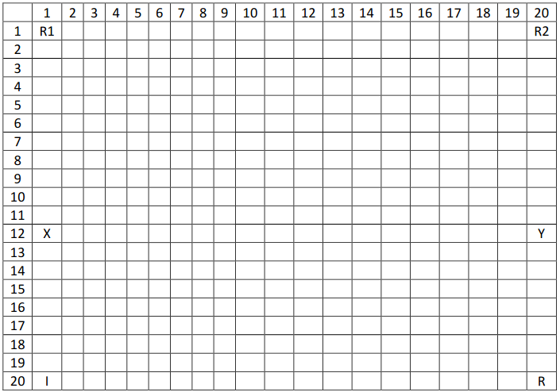

    Universidade Federal do Maranhão
    Departamento de Informática
    Inteligência Artificial
    Maria Jucimara Pereira Ferreira
---
# INTELIGÊNCIA ARTIFICIAL: AGENTES REATIVOS

## ROBÔS COLETORES DE LIXO

### Dois robôs estão coletando lixo.

- O  robô R1 procura lixos depositados no solo do planeta  e  quando algum lixo é  encontrado, o robô coleta o lixo e leva para uma das duas lixeiras presentes no ambiente, nos locais X e Y, larga o lixo lá e retorna a busca.

- O  robô  R2 tem  como  função  verificar  as  lixeiras  X  e  Y,e  caso  haja  lixo,  ele  levará  para um incinerador(I) ou para uma recicladora (R),se o lixo for orgânico ou reciclável, respectivamente.

### Quarenta (40) pedaços de lixo são colocados aleatoriamente no ambiente.

- Os robôs têm preferência por coletar lixo reciclável, pois demoram mais para se deteriorar no ambiente.
Cada robô pode carregar apenas um lixo por vez.

### Os  robôs podem executar as seguintes ações:

- Andar para esquerda, andar para direita, andar para cima, andar para baixo, pegar o lixo, soltar o lixo, NoOp.

### Os  robôs  têm  as  seguintes  percepções:

- local  onde  estão,  conteúdo  do  local,  conteúdo  dos  4 locais vizinhos ao local onde está, local das lixeiras, local do incinerador e da recicladora.

### O ambiente deve ter as dimensões 20x20
- o robô R1 inicia na posição 1x1,
- o robô R2 inicia na posição 1x20.
- As lixeiras estão em 12x1 e 12x20,
- o incinerador está em 20x1 e
- a recicladora em 20x20.

O  programa  pode  ser desenvolvido  em  dupla,  em  qualquer  linguagem  de  programação.  Os agentes devem ser implementados utilizando as 4 arquiteturas vistas em aula:
- reativo simples
- baseada em modelos
- objetivos
- utilidade

Deve-se medir o tempo de execução de cada uma das arquiteturas para avaliar qual teve o melhor desempenho. 
